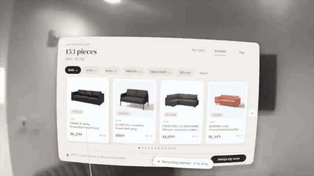

# VRShop

**Try a new room before you buy it.**

VRShop is a mixed-reality furniture shopping app built for Meta Quest 2. Browse real products, see them in your own space, replace the furniture you already have, and talk to an AI interior designer without taking off your headset.

Built for HackGT.

## Demo

[](https://www.youtube.com/watch?v=DlslMQg8jPs)

[Watch the demo on YouTube →](https://www.youtube.com/watch?v=DlslMQg8jPs)

## What you can do

- **Shop in your room.** Browse product photos, prices, and store links in a floating showroom. Filter by category, price, color, material, style, store, dimensions, and 3D availability.
- **Try furniture in place.** Move and rotate products, snap them against walls, and check for overlaps or blocked doorways. Put small plants and table lamps on supported real or virtual surfaces; they move with the furniture beneath them.
- **Keep or replace what you own.** Select furniture from Quest Space Setup, keep it as an obstacle, or preview a replacement in its spot. Cycle through alternatives and adjust the scanned box when it needs a better fit.
- **Talk to your designer.** Hold X or tap the floating orb to ask for furniture, refine results, compare prices, place an item where you point, or add it to your bag. Replies are spoken and captioned when OpenAI is configured.
- **Plan around your room.** “Design my room” arranges your cart—or recommended picks when the cart is empty—around kept furniture and fixed replacements.
- **Explore styles and themes.** Optionally upload room photos, describe the look you want, and set a budget. The backend uses that context to find and rank products, including themed requests.
- **Try “Buy the room.”** Review the cart, apply cheaper alternatives, and approve a budget-limited agent checkout demo with per-store progress and receipts.

For example: *“Black leather sofa under fifteen hundred.”* → *“Anything cheaper?”* → *“Put it here.”*

## How it works

The headset is the main experience. The phone companion is optional: it adds room photos, a written brief, browser-based product previews, and cart review. If no session exists, the headset creates a starter session automatically.

Room photos provide visual context. **Quest Space Setup provides the room geometry** used for placement, furniture boxes, and collision checks.

```text
Quest app (Unity / C#)                   Optional phone browser
  Passthrough + room geometry             Photos + style + budget
  Showroom + voice designer               Product previews + bag
  Placement + keep / replace              Checkout demo + receipts
                  \                         /
                   Node.js / TypeScript API
                   ├─ Room analysis + conversation
                   ├─ Local catalog → IKEA / Google Shopping
                   ├─ Official models → generated models → stand-ins
                   ├─ Room layout + replacement candidates
                   └─ Budget quotes + signed checkout demo
```

Product search starts with a locally cached catalog. Live searches supplement it when needed. Recommendations and conversation can use AI; layout placement, fit checks, budget calculations, and spending limits use application logic.

### 3D models and scale

The model pipeline tries these sources in order:

1. **Official IKEA GLB**, when available.
2. **An image-to-3D model** from fal, Meshy, or Tripo, when configured and generation is allowed.
3. **A procedural stand-in** when an official or generated model is unavailable.

Models are normalized for the headset. Dimensions come from official geometry or product listings when available, otherwise from estimates or category defaults. Generated models and stand-ins are previews, and estimated dimensions make fit checks approximate.

### Checkout demo

“Buy the room” groups the bag by retailer and asks for approval before starting. The agent signs requests using an implementation of Visa Trusted Agent Protocol, while local demo retailer endpoints verify signatures and enforce a spending mandate.

With Visa Acceptance sandbox credentials, the demo requests sandbox authorizations and supports reversals. Without credentials, payment results are labeled simulated. Roommate payment links are also supported, with a simulated fallback.

**This prototype does not place orders with IKEA, Amazon, or other real retailers.** Retailer checkout endpoints are simulated, and the Visa Intelligent Commerce instruction is a payload representation with local enforcement.

See [the Visa integration notes](docs/VISA.md) for the protocol flow and tamper demo.

## Run locally

### Requirements

- **Node.js 20+** and npm.
- **Unity 6000.3.13f1** for the headset app or Editor preview.
- For a Quest build: Android Build Support, OpenJDK, Android SDK & NDK Tools, a Quest 2 in Developer Mode, and a USB data cable.
- A network connection between the backend and your headset or phone.

### 1. Start the backend

```bash
git clone https://github.com/AbhirajTiwari12/vrshop.git
cd vrshop/backend
npm ci
cp .env.example .env

# Populate the catalog using IKEA only.
npm run catalog:pull -- --no-shopping

npm run dev
```

The server runs on port **8787** by default and prints its LAN URL. Open that URL in a browser to use the companion app. The health endpoint is `/api/health`.

You can start without API keys. IKEA search and available official models still require internet access; room analysis and typed requests use heuristic fallbacks, and payments are simulated.

### 2. Configure optional services

Edit `backend/.env` and restart the server after changes.

| Capability | Configuration |
| --- | --- |
| AI room analysis, conversation, transcription, and spoken replies | `OPENAI_API_KEY`; model and voice overrides are in `.env.example` |
| Google Shopping results | `SERPER_API_KEY` or `SERPAPI_KEY`; Serper is selected first when both are present |
| Image-to-3D generation | `FAL_KEY`, `MESHY_API_KEY`, or `TRIPO_API_KEY`; choose explicitly with `GEN_PROVIDER` |
| Visa Acceptance sandbox | `VISA_ACCEPTANCE_MERCHANT_ID`, `VISA_ACCEPTANCE_KEY_ID`, and `VISA_ACCEPTANCE_SECRET_KEY` |
| Device-facing server URL | `PUBLIC_BASE_URL`, if automatic LAN detection is unsuitable |

Use OpenAI model IDs available to your account through the corresponding `OPENAI_*_MODEL` settings. Keep the payment configuration on the sandbox host and use the supplied test card.

To expand the catalog with your configured shopping provider:

```bash
npm run catalog:pull
```

`SHOPPING_MONTHLY_LIMIT` caps Google Shopping calls; `LIVE_SEARCH=off` disables live catalog top-ups. See [the environment template](backend/.env.example) for all settings.

For a demo focused on official 3D assets, run `npm run catalog:check-3d`, then set `DEMO_3D_ONLY=on`. This restricts normal discovery to official-model products and disables automatic paid generation and paid shopping searches. Explicit model builds remain available.

### 3. Open the Quest app

1. Add the repository’s `unity/` folder in Unity Hub and open it with **6000.3.13f1**.
2. Let Unity install the pinned packages.
3. Open **VRShop → Setup Window**. Set the **Backend URL** to the LAN URL printed by the server and test the connection.
4. Use the setup window to configure the project and build the scene if needed, then **Build & Run on Quest (USB)**.
5. On Quest, complete **Space Setup** with walls, furniture, doors, and windows. Allow spatial-data and microphone permissions when prompted.

For an Editor preview without a headset, set the backend URL to `http://localhost:8787` and press Play. The Editor uses a sample room in place of passthrough. Switch back to the LAN URL before building for Quest.

See [the Unity setup guide](unity/README.md) for detailed build steps, Editor controls, and troubleshooting.

### 4. Add room context, optionally

Open the backend’s LAN URL on your phone. Upload room photos or enter a description, set a budget, and choose **Design my room**. The headset picks up the latest session automatically.

If the headset cannot connect, check that both devices can reach the same network. A phone hotspot can help on Wi-Fi networks that block communication between devices.

## Headset controls

| Input | Action |
| --- | --- |
| Trigger or grip on UI | Select |
| Trigger or grip on furniture, then move | Drag the item |
| Thumbstick left / right | Rotate the selected item |
| Point at real furniture and press trigger | Open Keep / Replace / Adjust controls |
| Thumbstick up / down on a replacement | Cycle through alternatives |
| **A** | Show or hide the showroom |
| **B** | Delete the selected virtual item |
| Hold **X** | Speak to the designer; release to send |
| Tap the floating orb | Start listening; tap during speech to interrupt |

The showroom has **For you**, **Browse**, and **Bag** tabs. Red footprints indicate placement conflicts. Furniture may pass through an obstacle while dragging, then move to a free position when released.

## Project structure

| Path | Purpose |
| --- | --- |
| [`backend/src/ai/`](backend/src/ai/) | Room analysis, shopping conversation, speech, and dimension estimation |
| [`backend/src/inventory/`](backend/src/inventory/) | Cached catalog, filters, themes, and shopping usage limits |
| [`backend/src/models/`](backend/src/models/) | Official downloads, image-to-3D providers, normalization, and stand-ins |
| [`backend/src/pay/`](backend/src/pay/) | Quotes, budget swaps, mandates, signatures, and sandbox checkout |
| [`backend/src/layout.ts`](backend/src/layout.ts) | Room layout and surface placement |
| [`backend/src/realFurniture.ts`](backend/src/realFurniture.ts) | Keep / replace state and replacement candidates |
| [`backend/public/`](backend/public/) | Browser companion built with HTML, CSS, and JavaScript |
| [`unity/Assets/VRShop/`](unity/Assets/VRShop/) | Quest app, shaders, setup tools, and Unity tests |
| [`docs/REAL_FURNITURE.md`](docs/REAL_FURNITURE.md) | Replacement rendering, box adjustment, and stacking details |
| [`docs/VISA.md`](docs/VISA.md) | Payment integration and demo walkthrough |

The Unity app uses Meta XR Core SDK, MR Utility Kit, OpenXR, URP, and glTFast. The backend uses Express and local file storage; runtime data and cached assets live under `backend/data/` by default.

## Development checks

From `backend/`:

```bash
npm run typecheck
npm test

# Integration exercise against a running backend:
npm run smoke
```

The smoke script creates a demo session and exercises discovery, conversation, checkout, model loading, layout, and real-furniture replacement. It can call configured external services and initiate sandbox checkout. Unity EditMode tests are in `unity/Assets/VRShop/Tests/Editor/`.

To clear sessions before a fresh demo, stop the server, run `npm run reset`, and restart it. Cached products and models are preserved.

## Prototype limits

- Quest 2 room geometry depends on manually drawn Space Setup boxes. Accurate boxes improve placement and occlusion.
- Replacing real furniture uses a shader that covers its box with approximated room surfaces. It does not reconstruct hidden textures or truly remove objects from the camera image.
- Model availability, visual fidelity, and measurement accuracy vary by product and provider.
- Catalog prices and availability are fetched snapshots. Checkout totals use listed item prices rather than final retailer shipping and tax calculations.
- Payment flows demonstrate authorization, signatures, and budget enforcement through demo retailers and sandbox or simulated payments.

IKEA product data and available 3D assets are fetched for this non-commercial prototype and credited to IKEA. Other product images, listings, and brands belong to their respective owners.
